## Exercise 1: Deploy the Azure HPC OnDemand Platform environment

Duration: 50 minutes

In this exercise, you will use Azure Cloud Shell to set up an `az-hop` environment.

### Task 1: Connect to a Cloud Shell session

1. From the lab computer, start a web browser, navigate to [the Azure portal](http://portal.azure.com), and if not already signed in, sign in with below credentials.

    **Email**: <inject key="AzureAdUserEmail"></inject>
    
    **Password**: <inject key="AzureAdUserPassword"></inject>

2. In the Azure portal, click on **Cloud Shell (1)** and in select either Bash or PowerShell, select **Bash (2)**.

    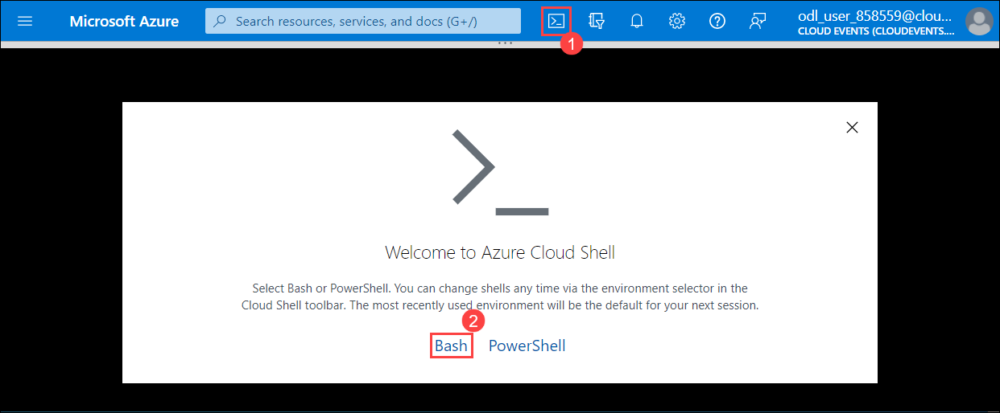

   > **Note** : If prompted, in the **Welcome to Azure Cloud Shell** window, select **Bash (Linux)**, and in the **You have no storage mounted** window, select **Create storage**.

    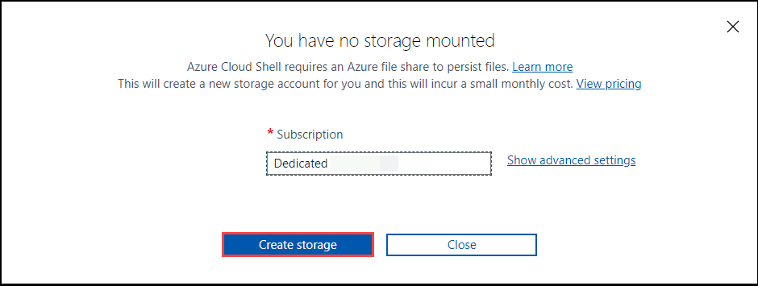

3. In the **Bash** session, in the **Cloud Shell** pane, run the following command to select the Azure subscription in which you will provision the Azure resources in this lab. In the following command, replace the `<subscription_ID>` placeholder with the value of the **subscriptionID** property of the Azure subscription you are using in this lab.

4. Run the `az account show` to display the current account and subscription used.

### Task 2 : Clone the `az-hop` GitHub repository

1. Run the following commands to clone the public `az-hop` gihub repository in your Cloud Shell session.

   ```bash
   git clone https://github.com/Azure/az-hop.git -b v1.0.29
   ```
    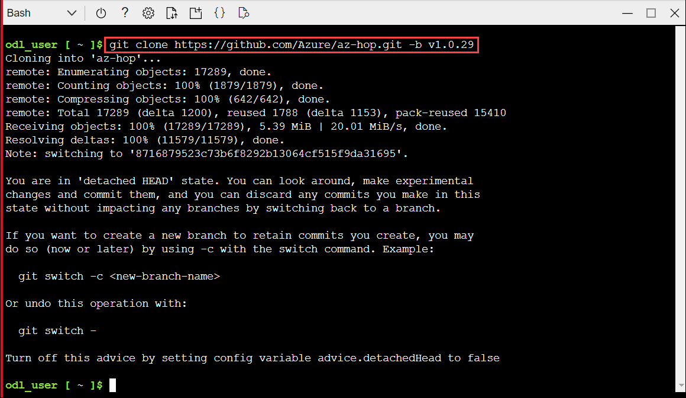

### Task 3 : Prepare the configuration file used to build the `az-hop` environment

In this task, you will prepare the `build.yml` file used by the deploy helper script in order to build the `az-hop` environment.

1. Change directory into the deploy folder and copy the build template file.

   ```bash
   cd az-hop
   cp ./tutorials/quickstart/build.yml ./deploy/.
   ```
   
2. Review the `build.yml` file content, which describe the resources that will be provisioned. In addition to these an Azure Bastion will also be automatically created to be used to connect securely to this environment.

    > **Note** : If your subscription policy requires you to run without public IP then update your `build.yml` configuration file and set `vms.ondemand.pip` to `false`.

3. Run the pre-requisites script to install any missing components.

   ```bash
   cd deploy
   ./pre-reqs.sh
   ```

   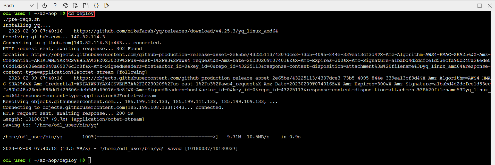

4. Fix the install.sh script in the `deploy/resources` folder.  

    ```bash
    cd resources
    vi install.sh
    ```

5. Change the `install.sh` script from `git clone --recursive https://github.com/Azure/az-hop.git` to below line. To edit the file press `i`.

    ```bash
    git clone --recursive https://github.com/Azure/az-hop.git -b v1.0.29
    ```

    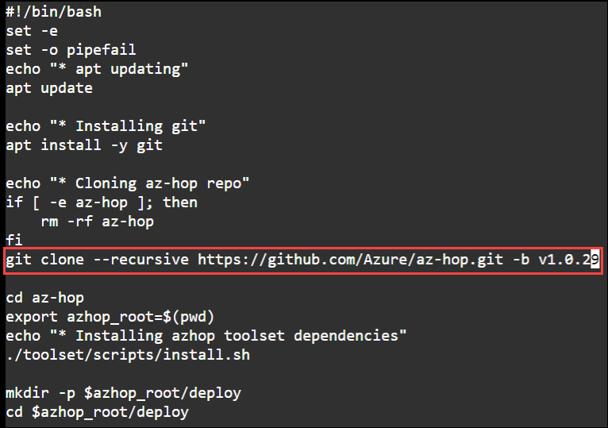

5. Then press **_ESC_**, write **_:wq_** to save your changes and close the file. Once the file is saved run `cd ..` to change the directory.
    
    >**Note**: If **_ESC_** doesn't work press `ctrl+[` and then write **_:wq_** to save your changes and close the file.     
    

### Task 4 : Deploy the environment

1. Retrieve the azure location name in which you will deploy this environment by running this command.

    > **Note** : The `name` column contains one of the value to be used in the deployment command.

   ```bash
   az account list-locations -o table
   ```

2. Run the deploy command and pass the resource group name `azhop_quickstart`, replace <location> with **<inject key="Region" />**, and the version of azhop to use.

   ```bash
   ./deploy.sh azhop_quickstart <location> v1.0.29
   ```

   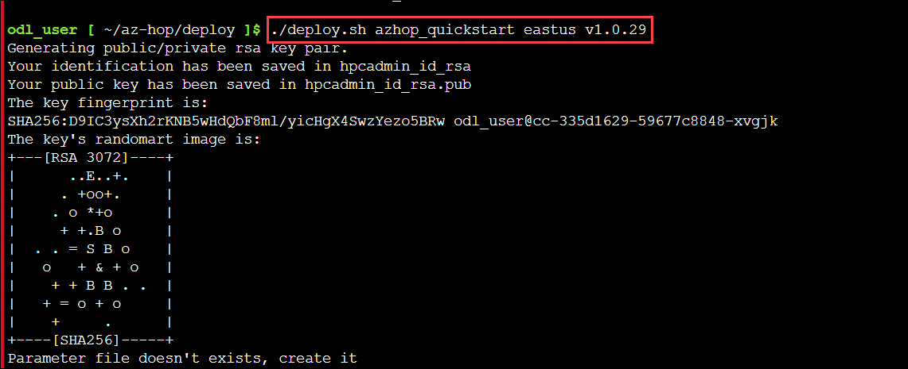

While the deployment is in progress, you can check the resource group content from the Azure portal and the status of the deployment thru the link at the right of the `Deployments` property. The deployment should be done in about 8 minutes.

Once the deployment is done, you can now access the deployer VM thru Azure Bastion

### Task 5 : Connect to the `deployer` VM thru Azure Bastion
In this task you will connect to the Deployer VM thru Azure Bastion to monitor the Ansible playbooks progress.

> **Note**: Azure Bastion allows users to connect to Azure VMs without relying on public endpoints and helps provide protection against brute force exploits that target operating system level credentials.

1. Close the **Cloud Shell** pane.

    

2. In the Azure Portal, select **Resource groups**.

    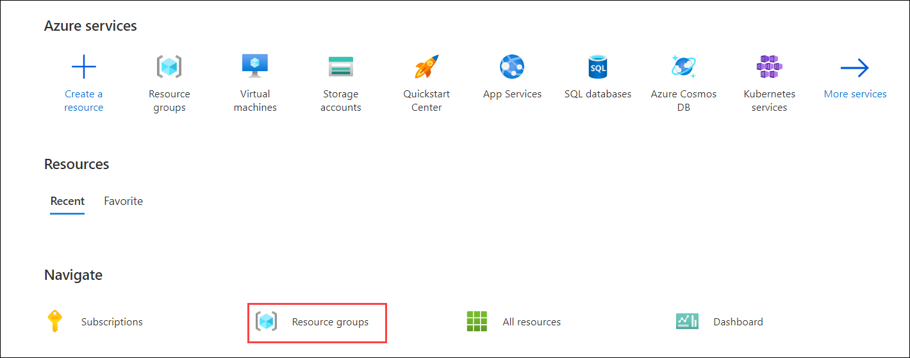

3. Select the resource group you have created with the name `azhop_quickstart`.

    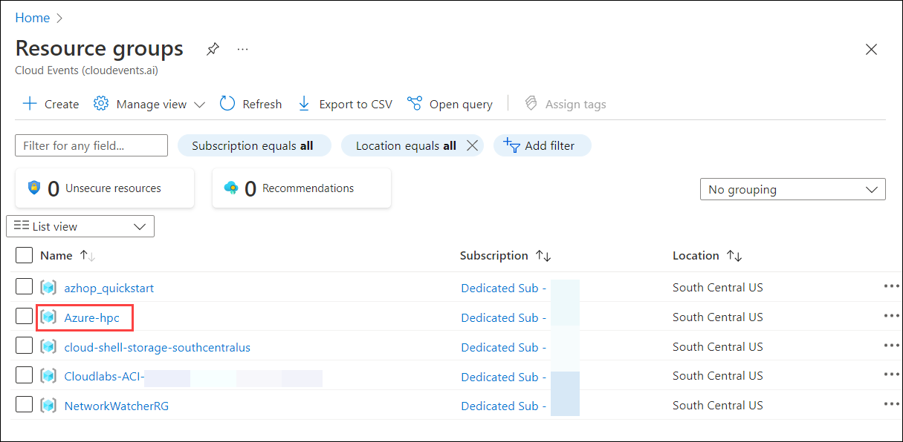

4. In search bar enter deployer, click on the **deployer** Virtual machine.

    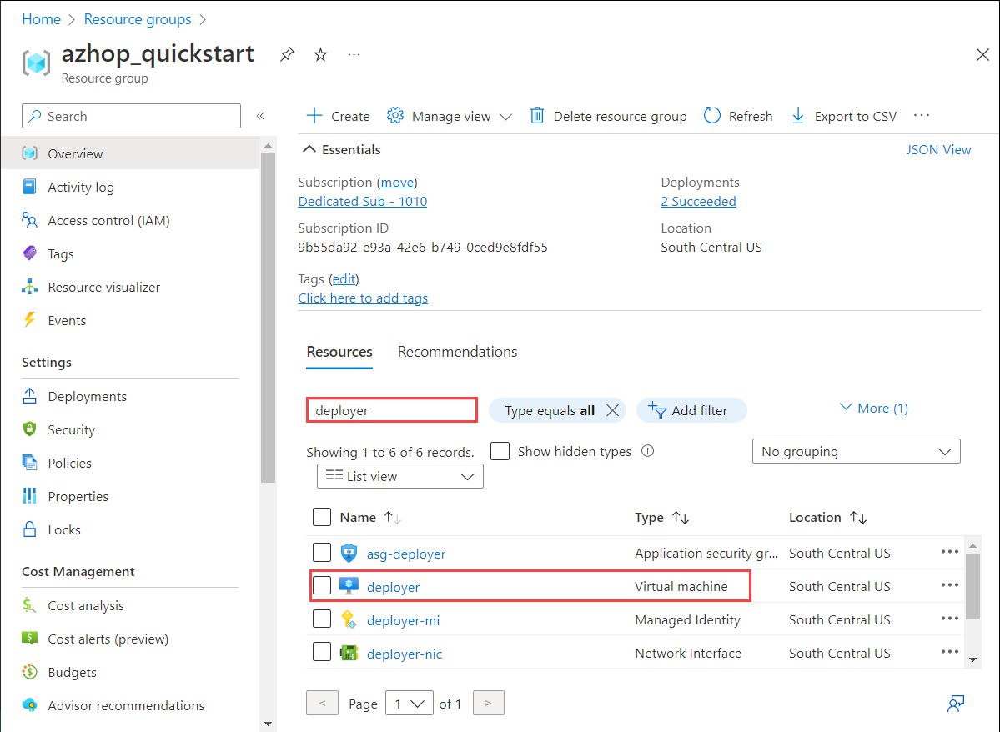

5. Expand the **Connect** menu and select **Bastion**.

    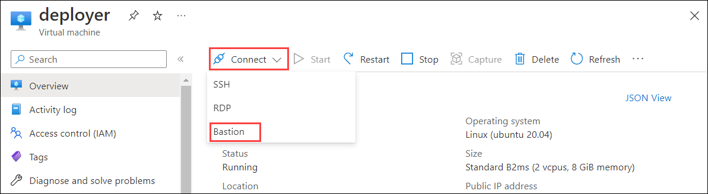

6. Enter the followind details:
   
    - Enter **hpcadmin (1)** as the user name
    - Select **SSH Private Key from Azure Key Vault (2)** in the **Authentication Type**
    - Select your **subscription (3)**
    - Select the keyvault from the `azhop_quickstart` **(4)** resource group
    - Select **hpcadmin-privkey (5)** in the **Azure Key Vault Secret**
    - Select **Connect (6)**. 

        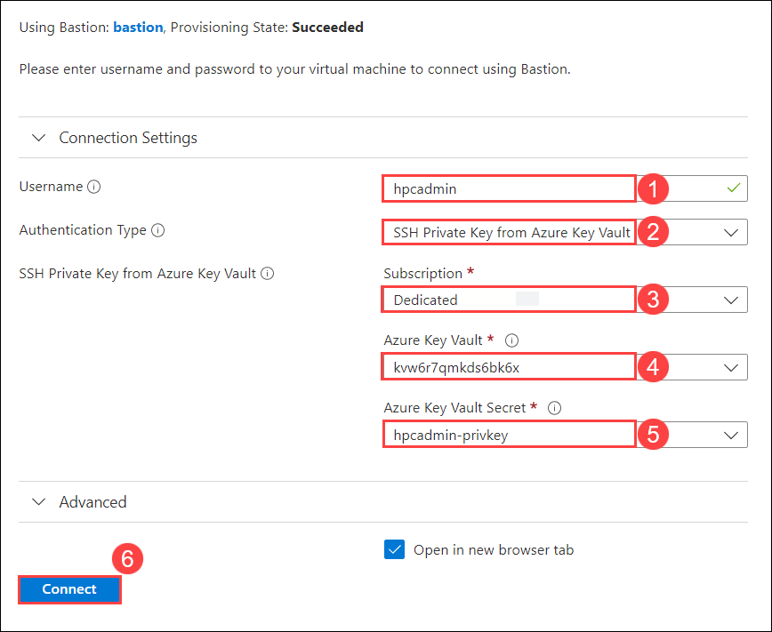
  
        > **Note**: You may have to disable the popup blocker as it may block the connection window.

        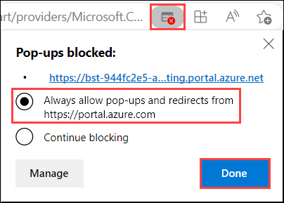

### Task 6 : Monitor the installation progress

1. Once connected in the `deployer` VM run the following command to display the cloud init log content

    ```bash
    tail -f /var/log/cloud-init-output.log
    ```

    >**Note** :Once the cloud init script is finished you should have these 2 lines at the end of the log

    ```
    Cloud-init v. 22.3.4-0ubuntu1~20.04.1 running 'modules:final' at Fri, 21 Oct 2022 13:22:56 +0000. Up 22.03 seconds.
    Cloud-init v. 22.3.4-0ubuntu1~20.04.1 finished at Fri, 21 Oct 2022 14:06:09 +0000. Datasource DataSourceAzure [seed=/dev/sr0].  Up 2614.99 seconds
    ```

    > **Note** : The Cloud Init step is taking about 40 minutes.

    > **Note**: If installation of telegraf got failed, click on **ctr + c**, and continue with the next task as it will not effect the flow of the lab.

    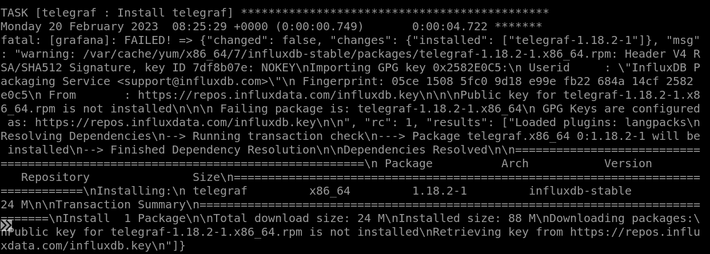

2. Confirm there are no errors in the playbooks execution by running this command

   ```
   grep "failed=1" /var/log/cloud-init-output.log
   ```

### Task 7 : Retrieve the homepage URL and user account to connect with Azure HPC On-Demand Platform

1. The `az-hop` environment is only accessible thru an Open OnDemand portal, to retrieve it's FQDN you have to browse to the az-hop directory and get it from one of the Ansible parameter file. As cloud-init was run as root you have to work as root from now on the deployer VM.

   ```bash
   sudo su -
   cd /az-hop
   grep ondemand_fqdn ./playbooks/group_vars/all.yml
   ```
2. Copy the **ondemand_fqdn** value and save it in a text editor like notepad as we will using thought out the lab.

   > **Note**: your ondemand_fqdn will look similar to as below.

     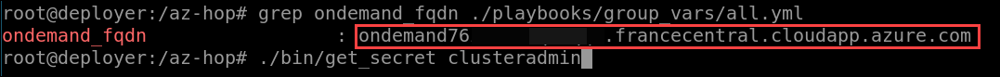

    ```
    ondemand_fqdn : ondemandk6x4nkh3hhmsux.westeurope.cloudapp.azure.com
    ```

3. The default admin user created on this `az-hop` environment is called `clusteradmin`. To retrieve the password generated and stored in the keyvault, run the following helper script :
   
   ```bash
   ./bin/get_secret clusteradmin
   ```

    > **Note**: Record these values. You'll need them throughout the remainder of this lab.

### Task 8 : Access the `Azure HPC On-Demand Platform` dashboard

1. From the lab computer, start a web browser, navigate to the URL of the Azure HPC On-Demand Platform portal you identified earlier in this task, and when prompted sign in with the **clusteradmin** user account and its password you identified in the previous step.

    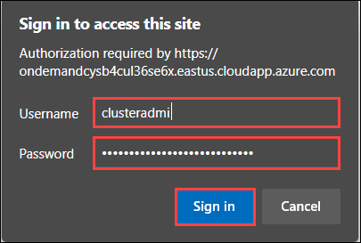

   > **Note**: You'll be presented with the **Azure HPC On-Demand Platform** dashboard. Review its interface, starting with the top-level menu, which provides access to **Apps**, **Files**, **Jobs**, **Clusters**, **Interactive Apps**, **Monitoring**, and **My Interactive Sessions** menu items.

2. In the **Monitoring** menu, select **Azure CycleCloud**.

    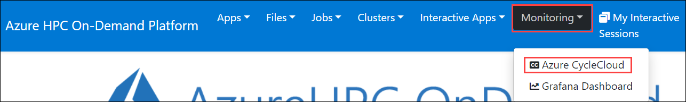

3. When presented with the page titled **App has not been initialized or does not exist**, select **Initialize App**.

    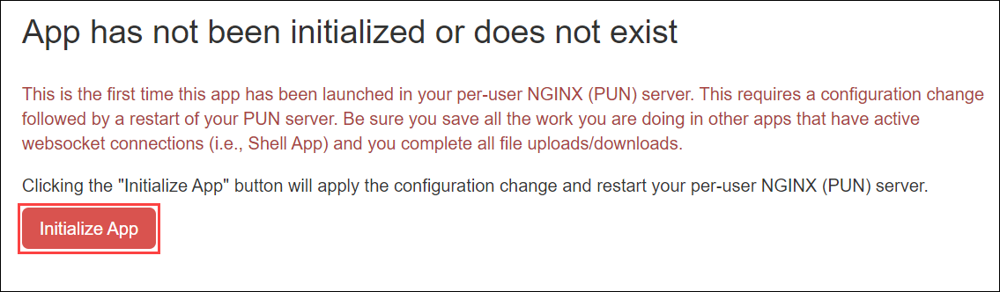

   > **Note**: This prompt reflects the OnDemand component architecture, which the Azure HPC OnDemand Platform solution relies on to implement its portal. The shared frontend creates Per User NGINX (PUN) processes to provide connectivity to such components as **Azure CycleCloud** and **Grafana**.

4. On the **Azure CycleCloud for Azure HPC On-Demand Platform** page, note the presence of a configuration of a cluster named **pbs1**.

5. On the **pbs1** page, select the **Arrays** tab, and note that it contains entries representing queue definitions defined in the **/az-hop/config.yml** file.

    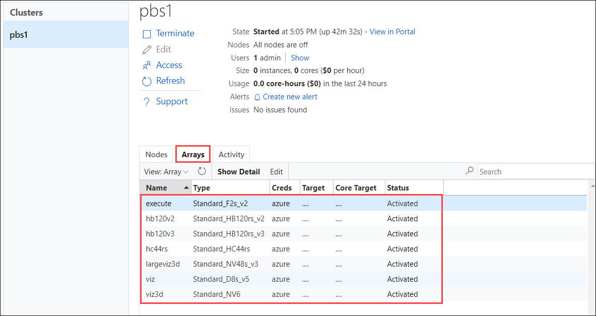

6. Click the **Next** button located in the bottom right corner of this lab guide to continue with the next exercise.    
