## Exercise 2: Review the main az-hop features

Duration: 60 minutes

In this exercise, you will review the main features of the Azure HPC OnDemand Platform lab environment.

### Task 1: Using file explorer

> **Note**: For more information regarding this topic, refer to [https://azure.github.io/az-hop/user_guide/files.html](https://azure.github.io/az-hop/user_guide/files.html)

> **Note**: You can access your home directory files directly from the OnDemand interface.

1. On the lab computer, in the browser window, in the **Azure HPC On-Demand Platform** portal, select the **Files** menu. Then, from the drop-down menu, select **Home Directory**.

      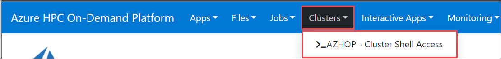

2. On the **Home Directory** page, review its interface, including the options to:

   - Create directories and files.
   - Upload and download files.
   - Perform copy and move operations.
   - Delete directories and files.
   - Open the terminal window in the current file system location.

   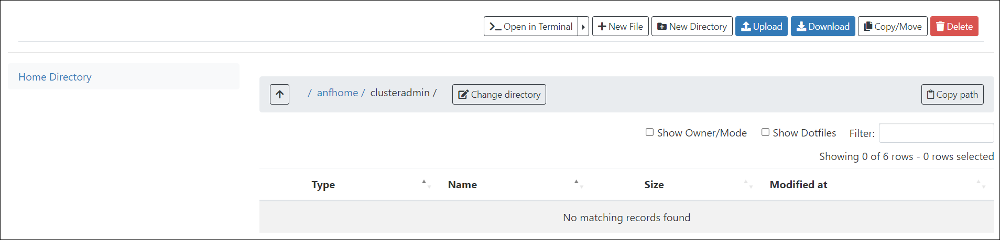

### Task 2: Using shell access

> **Note**: For more information regarding this topic, refer to [https://azure.github.io/az-hop/user_guide/clusters.html](https://azure.github.io/az-hop/user_guide/clusters.html)

1. In the **Azure HPC On-Demand Platform** portal, select the **Clusters** menu, and then from the drop-down menu, select **AZHOP - Cluster Shell Access**.

      

   > **Note**: This will open another browser tab displaying a shell session to the cluster.

2. In the shell session, run the following command to submit a simple test job:

   ```bash
   qsub -l select=1:slot_type=execute -- /usr/bin/bash -c 'sleep 60'
   ```


   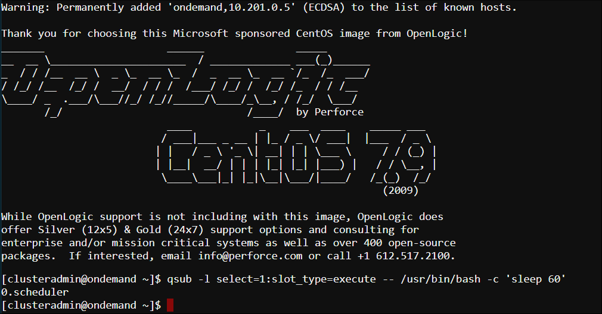

   > **Note**: Be careful when pasting the commands to make sure the exacts characters are used, especially for hyphen.

3. In the shell session, run the following command to display the status of the submitted job:

   ```bash
   qstat -anw1
    ```

      > **Note**: The output should resemble the following listing:

    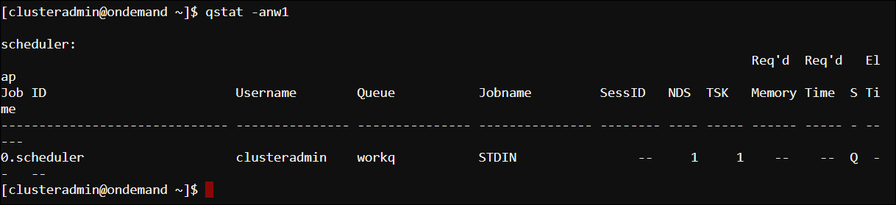
    
    ```
    scheduler:
                                                                                                      Req'd  Req'd   Elap
   Job ID                         Username        Queue           Jobname         SessID   NDS  TSK   Memory Time  S Time
   ------------------------------ --------------- --------------- --------------- -------- ---- ----- ------ ----- - -----
   0.scheduler                    clusteradmin    workq           STDIN                --     1     1    --    --  Q  --   --
   [clusteradmin@ondemand ~]$
   ```

   > **Note**: Examine the output of the command and verify that the submitted job is in the queue.

4. Switch to the browser tab with the **Azure CycleCloud for Azure HPC On-Demand Platform** page. After some time (less than a minute), a new **execute** instance is created.

5. Review the newly created job's progress, including the new VM creation.

### Task 3: Hello World job

1. On the lab computer, in the browser window displaying the Azure HPC On-Demand Platform portal, navigate to the **Dashboard** page. On the **Dashboard** page, select the **Jobs** menu title, and from the drop-down menu, select **Job Composer**.

      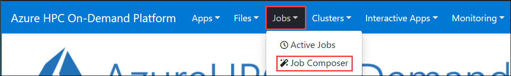

2. On the **Jobs** page, select **+ New job**, and from the drop-down menu, select **From Default Template**.

      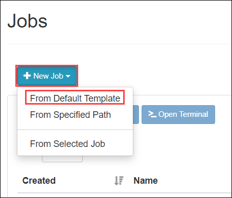

   > **Note**: This will automatically create a job named **(default) Sample Sequential Job** that targets the **execute** CycleCloud array. To identify the content of the job script, ensure that the newly created job is selected, and then review the **Script contents** pane.

3. Repeat the previous step twice to create two additional jobs based on the default template.

   > **Note**: The default job template contains a trivial script that runs `echo "Hello World"`.

4. Note that all three jobs are currently in the **Not Submitted** state. To submit them, select each one of them, and then select **Submit**.

      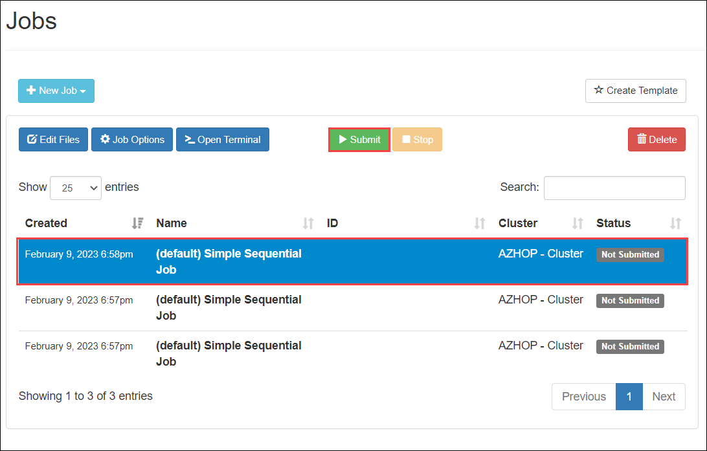

   > **Note**: The status of the jobs should change to **Queued**.

5. On the lab computer, in the browser window displaying the Azure HPC On-Demand Platform portal, select the **Azure HPC On-Demand Platform** header. Select the **Monitoring** menu, and from the drop-down list, select **Azure CycleCloud**.

      

6. In the **Azure CycleCloud for Azure HPC On-Demand Platform** portal, monitor the status of the cluster and note that the number of nodes increased to **2**, which initially are listed in the **acquiring** state. This can takes a minute to come.

      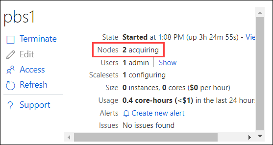

7. On the **Nodes** tab, verify that **execute** appears in the **Template** column, the **Nodes** column contains the entry **2**, and the **Last status** column displays the **Creating VM** message.

      

8. In the **Azure CycleCloud for Azure HPC On-Demand Platform** portal, on the **pbs1** page, select the **Scalesets** tab. Note a scaleset that hosts the cluster nodes with its size set to **2**.

9. Select the entry on the **Nodes** tab, and then review the details of the cluster nodes in the lower section of the page, including:
   - The name of each node
   - The status of each node
   - The number of cores
   - The placement group

      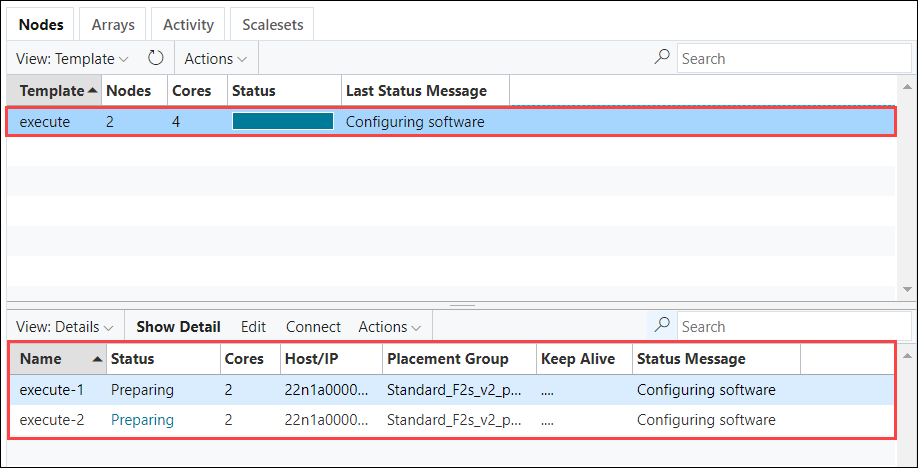
   
10. Navigate to the **Azure HPC On-Demand Platform** portal

11. Select the **Jobs** menu, and from the drop-down menu, select **Active jobs**.

      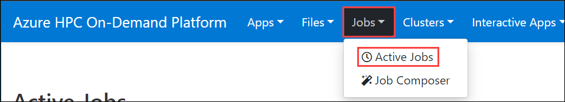

12. On the **Active jobs** page, verify that three active jobs are listed in the **Queued** status.

      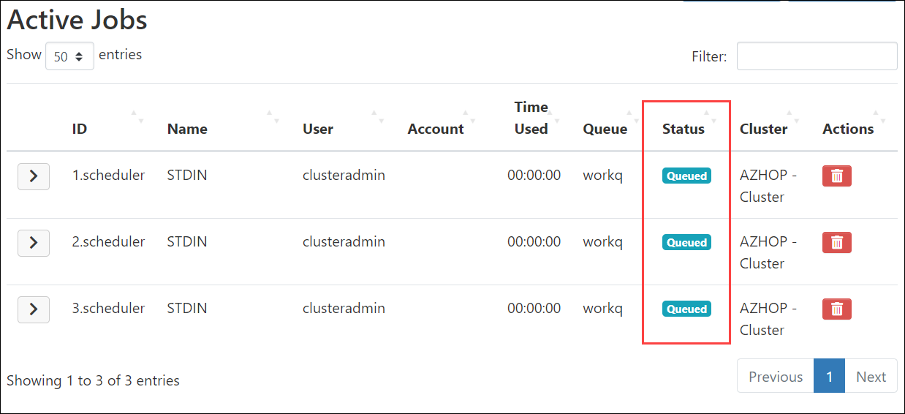

13. Navigate to the **Azure CycleCloud for Azure HPC On-Demand Platform** portal, and then monitor the progress of node provisioning.

      > **Note**: Wait until the status of nodes changes to **Ready**. This should take about 5 minutes.

14. After the nodes status changes to **Ready**, switch to the **Active jobs** page.

15. Refresh the **Active jobs** page and note that the jobs are no longer listed.

      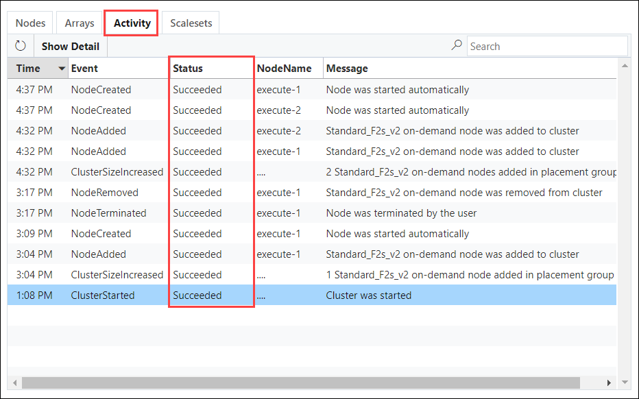

      > **Note**: If the jobs are still listed as **Queued**, wait for a few more minutes, and then refresh the page again.

16. Navigate back to the **Job Composer** page, and note that all jobs are now completed.

      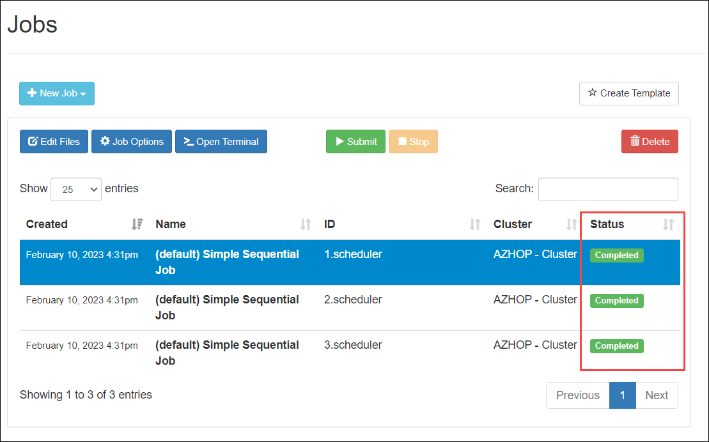

17. Select one of the completed job, and in the right panel, under **Folder Contents** click on the **STDIN.o??** file to look at it's content.

      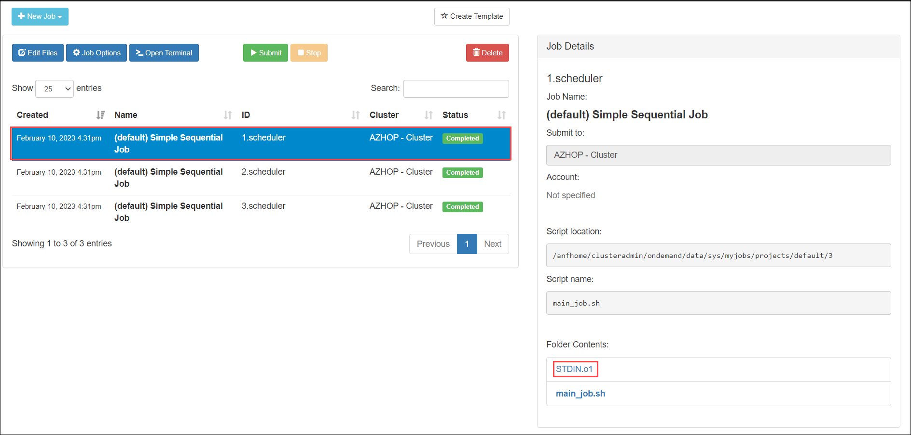

      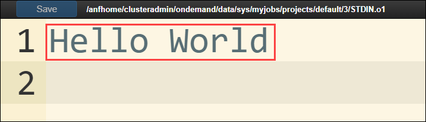

18. Navigate back to the **Azure CycleCloud for Azure HPC On-Demand Platform** portal and monitor the node status until it changes to terminating, which will result eventually in their deletion. This should be done after about 15 minutes of idle time.

      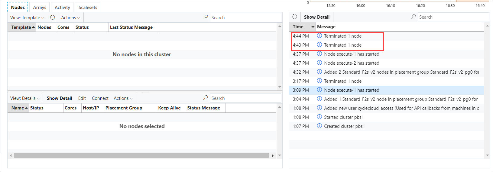

19. In the **Azure CycleCloud for Azure HPC On-Demand Platform** portal, on the **pbs1** page, select the **Scalesets** tab.

20. Note that the scaleset hosting the cluster nodes persists but its size is set to **0**.

      

### Task 4: Running Intel MPI PingPong jobs from the Job composer

1. On the lab computer, in the browser window, switch back to the **Azure HPC On-Demand Platform** portal.

2. Select the **Jobs** menu, and from the drop-down menu, select **Job Composer**.

      

3. On the **Jobs** page, select **Templates**.

      

4. On the **Templates** page, in the list of predefined templates, select the **Intel MPI PingPong** entry, and then select **Create New Job**.

      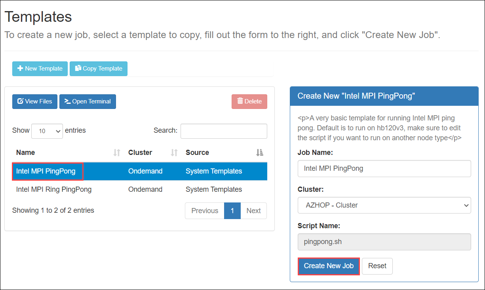

   > **Note**: The Message Passing Interface (MPI) ping-pong tests measure network latency and throughput between nodes in the cluster by sending packets of data back and forth between paired nodes repeatedly. The *latency* is the average of half of the time that it takes for a packet to make a round trip between a pair of nodes, in microseconds. The *throughput* is the average rate of data transfer between a pair of nodes, in MB/second.

   > **Note**: This will automatically create a job named **Intel MPI PingPong** that targets the **hb120v3** slot_type, as this lab is setup for **hb120v2** you will have to update the job file.

5. In the **Submit Script** from the right panel, click on the button **Open Editor** at the bottom. This will open a new tab with the pingpong script open.

      

6. On line 3, change **hb120v3** to **hb120v2**. Click on the **Save** button and close the tab.

      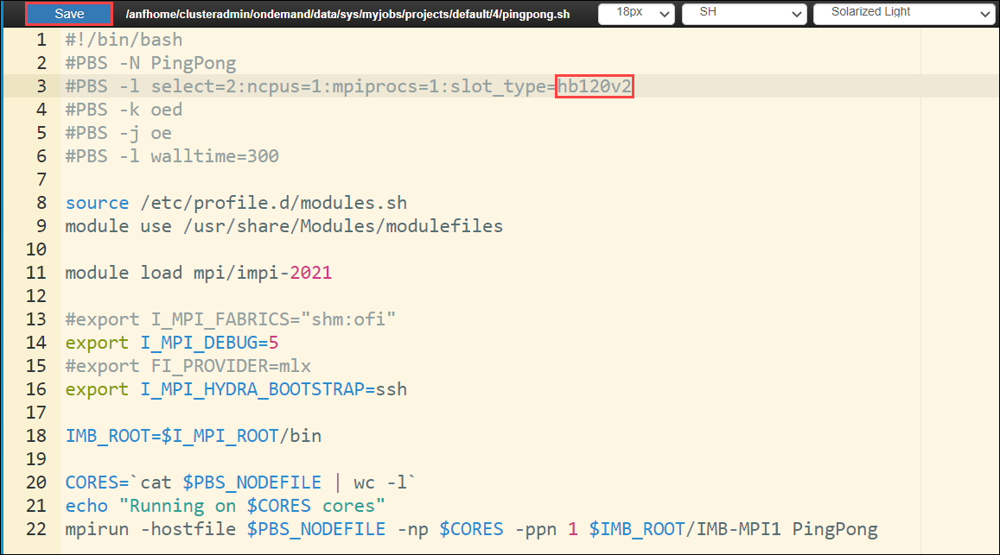

7. Create two additional jobs based on the **Intel MPI PingPong** job by expanding the **+ New Job** button and chosing the **From Selected Job**.

      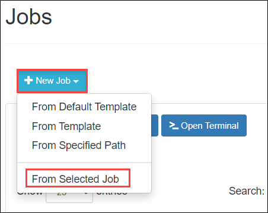

8. Note that, as before, all three jobs are currently in the **Not Submitted** state. To submit them, select each one of them, and then select **Submit**.

      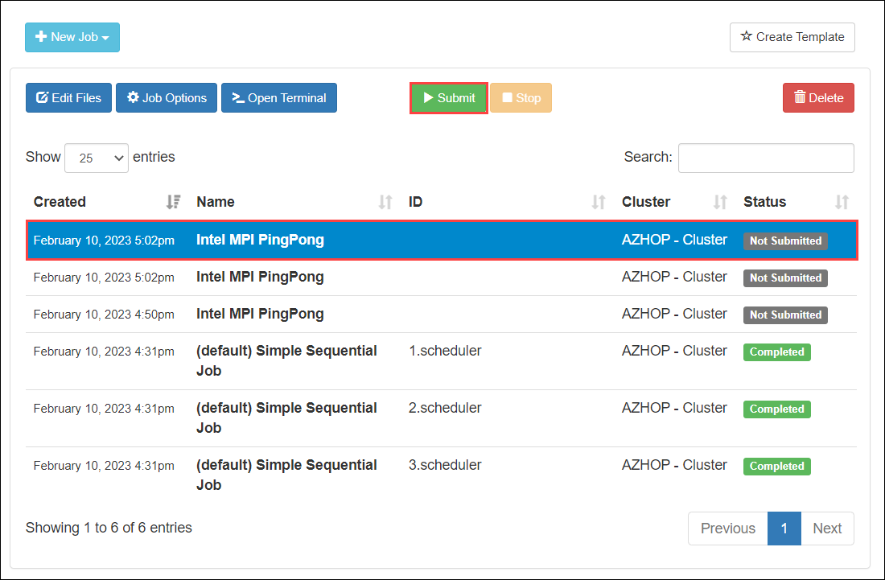

   > **Note**: The status of the jobs should change to **Queued**.

9. Navigate to the **Azure CycleCloud for Azure HPC On-Demand Platform** portal and monitor the node provisioning progress.

      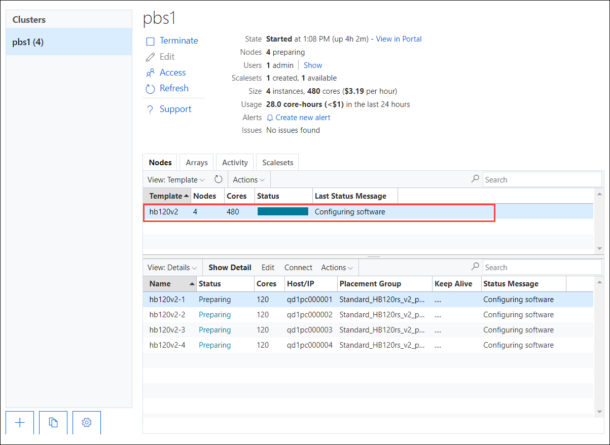

   > **Note**: Wait until the nodes' status changes to **Ready**. This should take about 10 minutes.

   > **Note**: Despite asking for 3 jobs with 2 nodes each, only 4 machines are provisioned, this is because the configuration has been set to a maximum of 4 machines for this environment.

10. After the node status changes to **Ready**, switch back to the **Active jobs** page, and then refresh it. Note that the jobs are no longer listed.

      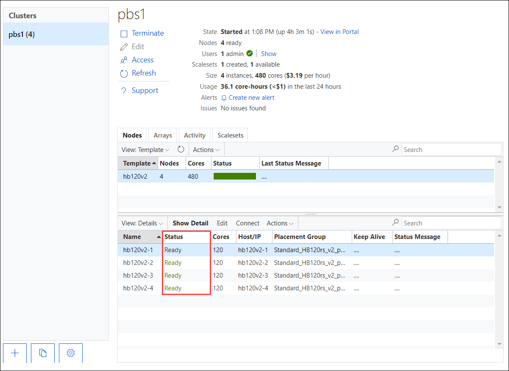

      > **Note**: If the jobs are still listed as **Queued**, wait for a few more minutes, and then refresh the page again.

11. To review the job output, switch to the **Azure HPC On-Demand Platform** portal, select the **Jobs** menu, and then from the drop-down menu, select **Job Composer**.

      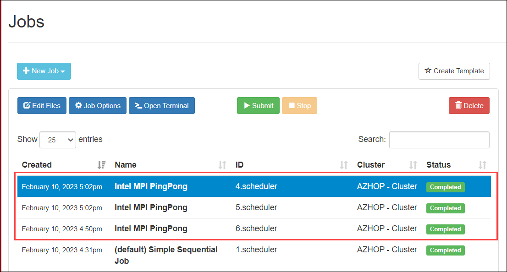

12. On the **Jobs** page, select any of the **Intel MPI PingPong** job entries, and in the **Folder Contents** section, select **PingPong.o??**.

      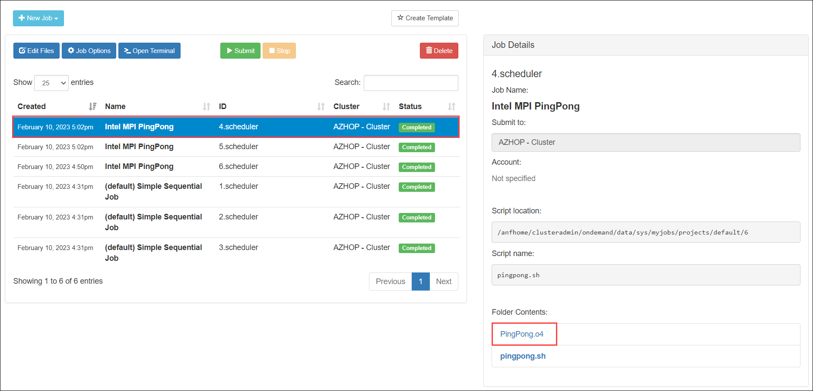

13. Navigate to the **Azure CycleCloud for Azure HPC On-Demand Platform** portal and monitor the node status until it changes to terminating, resulting eventually in their deletion.

      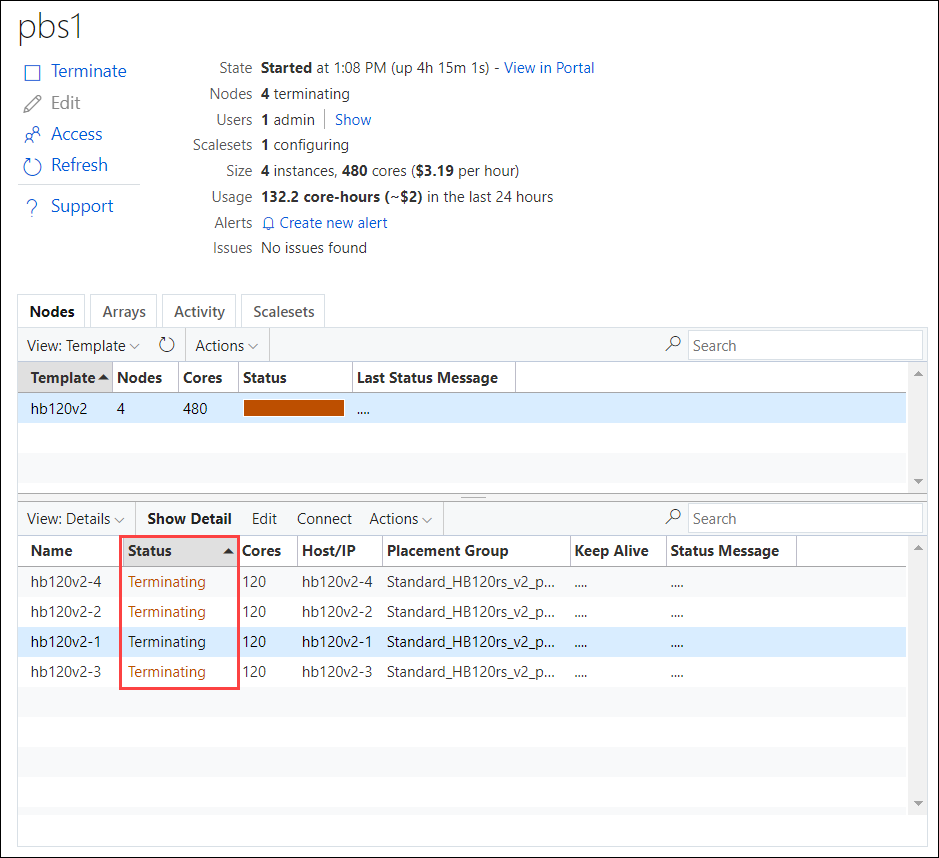

14. In the **Azure CycleCloud for Azure HPC On-Demand Platform** portal, on the **pbs1** page, select the **Scalesets** tab.

      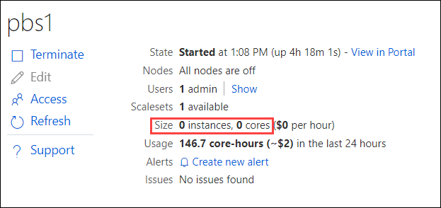

15. Note that the scaleset hosting the cluster nodes persists but its size is set to **0**.

      > **Note**: This will automatically open another web browser tab displaying the output of the job.

### Task 5: Running interactive apps using Code Server and Linux Desktop

> **Note**: For more information regarding this topic, refer to [https://azure.github.io/az-hop/user_guide/code_server.html](https://azure.github.io/az-hop/user_guide/code_server.html) and [https://azure.github.io/az-hop/user_guide/remote_desktop.html](https://azure.github.io/az-hop/user_guide/remote_desktop.html)

1. On the lab computer, in the browser window, switch to the tab displaying the **Azure HPC On-Demand Platform** portal.

2. Select the **Interactive Apps** menu, and then from the drop-down menu, select **Code Server**.

      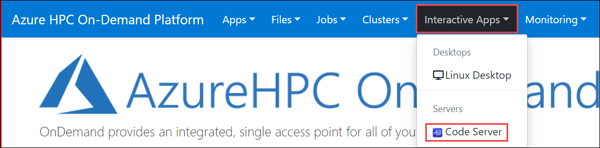

      > **Note**: This will open another browser tab displaying the **Code Server** launching page.

3. On the **Code Server** launching page, in the **Maximum duration of your remote session** field, enter **1**. In the **Slot Type** text box, enter **execute**, and then select **Launch**.

      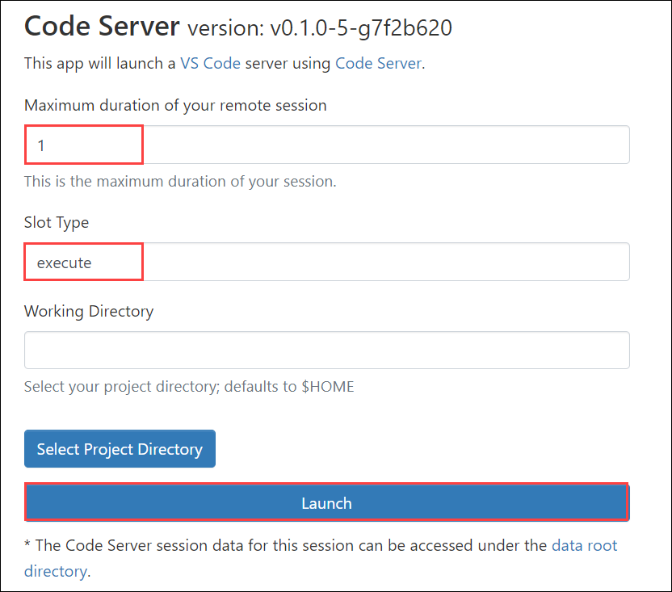

      > **Note**: This will initiate the provisioning of a compute node of the type you specified. Note that this creates a new job and the **Queued** status for this job is displayed on the same page.

4. Switch to the **Azure CycleCloud for Azure HPC On-Demand Platform** portal and monitor the **execute** node provisioning's progress.

      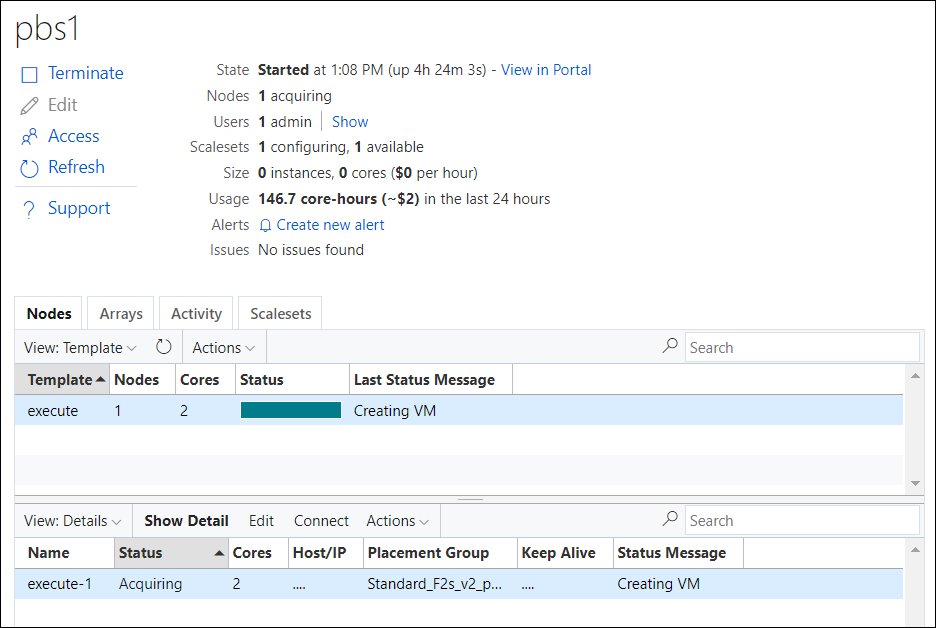

      > **Note**: Wait until the node status changes to **Ready**. This should take about 5 minutes.

5. Switch back to the **Code Server** launching page.

6. Verify that the corresponding job's status has changed to **Running**, and then select **Connect to VS Code**.

      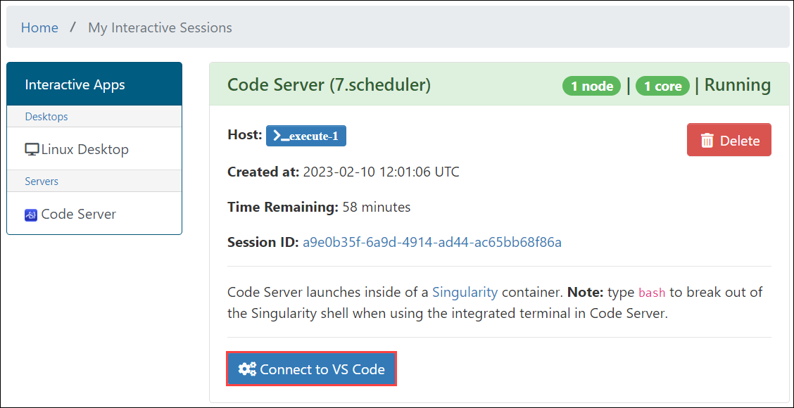

      > **Note**: This will open another browser tab displaying the Code Server interface.

7. Review the interface, and then close the **Welcome** tab.

8. In the top left corner of the page, select the **Application** menu. From the drop-down menu, select **Terminal**, and then in the cascading menu, select **New Terminal**.

      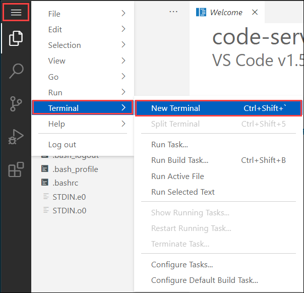

9. In the **Terminal** pane, at the **[clusteradmin@execute-1 ~]$** prompt, enter `qstat` to observe the currently running job.

      

10. You can now edit any files located in your home directory, git clone repos and connect to your GitHub account.

11. Switch back to the **Azure HPC On-Demand Platform** home page, or the `Dashboard`. Select **Linux Desktop**.

      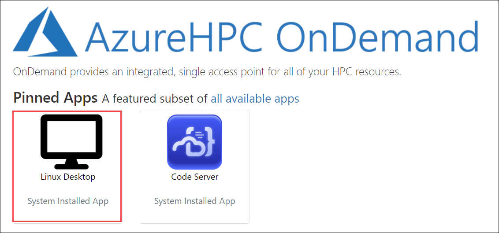

12. On the **Linux Desktop** launching page, 

      - **Session target** : from the drop-down list, select `With GPU - Small GPU node for single session`.
      - **Maximum duration of your remote session**: enter `1`
      - Select **Launch**.

        

      > **Note**: This will begin compute node provisioning of the type you specified. This also creates a new job with its **Queued** status displaying on the same page.

13. Switch back to the **Linux Desktop(1)** launching page.
      - **Session target** : from the drop-down list, select `Without GPU - for single session (2)`.
      - In the **Maximum duration of your remote session** field, enter `1 (3)`
      - Select `Launch (4)`.

        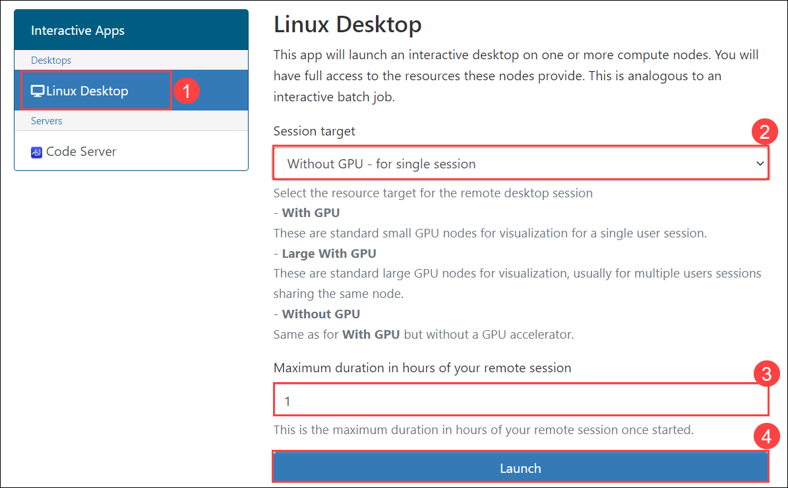

      > **Note**: The ability to extend the time you specify is not supported. After the time you specified passes, the session terminates. However, you can choose to terminate the session early.

      > **Note**: This will initiate the provisioning of a compute node of the type you specified. Note that this creates a new job and the **Queued** status for this job is displayed on the same page.

14. Switch to the **Azure CycleCloud for Azure HPC On-Demand Platform** portal and monitor the progress of the **viz** and **viz3d** node provisioning.

      > **Note**: Wait until the status of the node changes to **Ready**. This should take about 10 minutes.

      > **Note**: The **viz3d** node provisioning will fail if your subscription doesn't offer **Standard_NV6** SKU in the Azure region hosting your az-hop deployment.

15. Switch back to the **My Interactive Sessions** page, and then verify that the corresponding job's status has changed to **Running**.

16. Use the **Delete** button to delete one of the **Linux Desktop** session by selecting **Confirm** when prompted.

      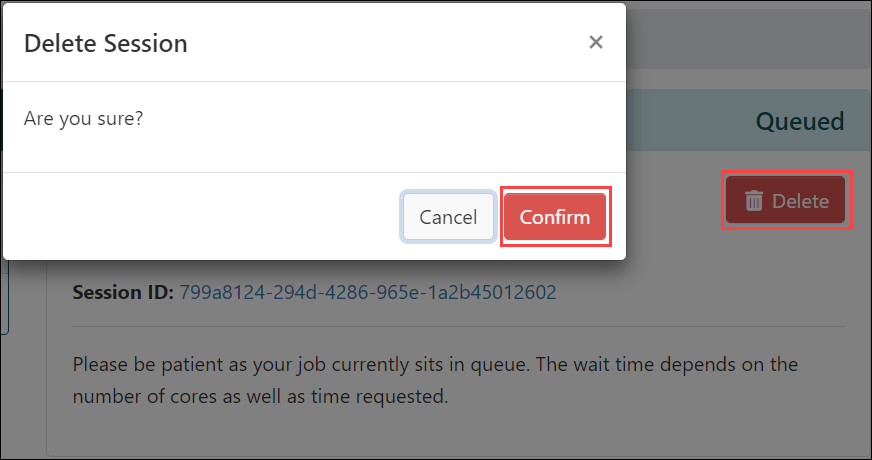

17. On the session with hosts named `viz3d-1`, adjust **Compression** and **Image quality** according to your preferences, and then select **Launch Linux Desktop**.

      

      > **Note**: This will open another browser tab displaying the Linux Desktop VNC session.

18. Click on **Applications** and open a **Terminal Emulator**. 

      

19. Once the teminal is open, run the below command to validate that GPU is enabled

      ```bash
      nvidia-smi
      ```

      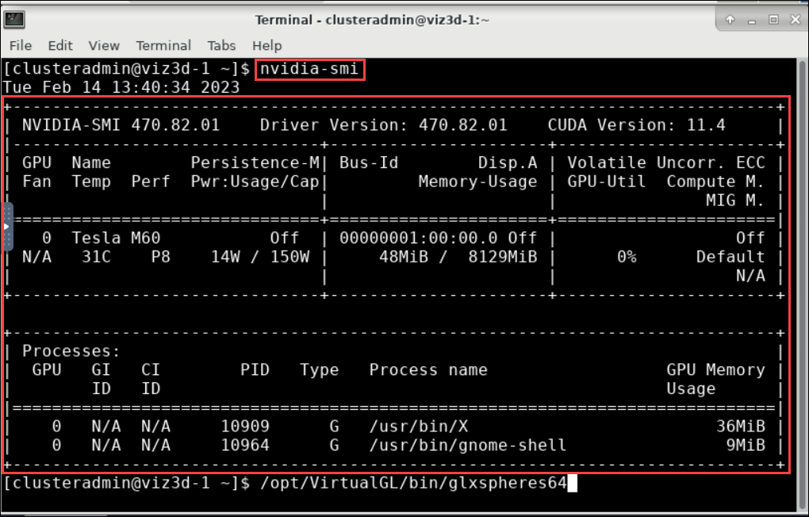

19. In the open terminal run the below command and observed the performances. 

      ```bash
      /opt/VirtualGL/bin/glxspheres64
      ```
      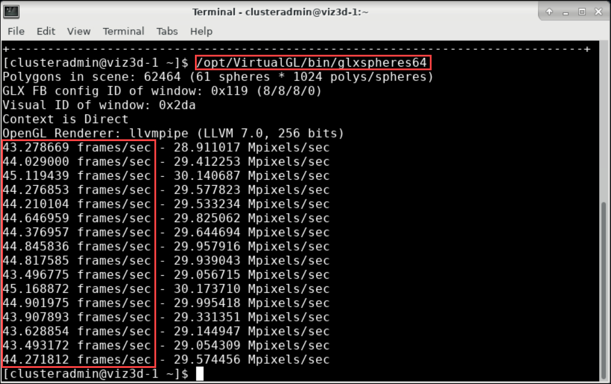

20. This is running witout GPU acceleration and should deliver about **40 frames/sec**.

      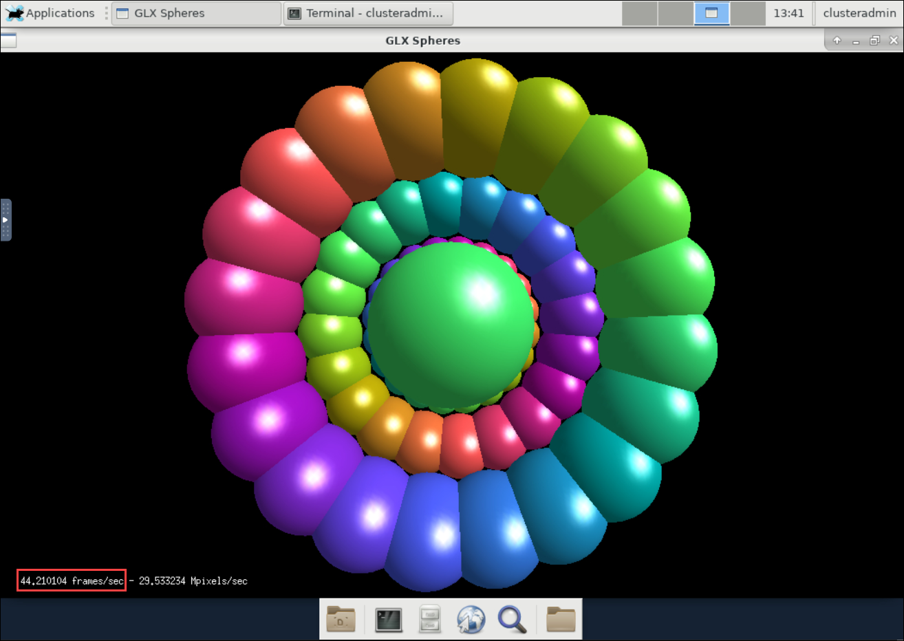

21. Close the **GLX Spheres** window and rerun it by prefixing the command with vglrun to offload Opengl to the GPU. 

      ```bash
      vglrun /opt/VirtualGL/bin/glxspheres64
      ```

      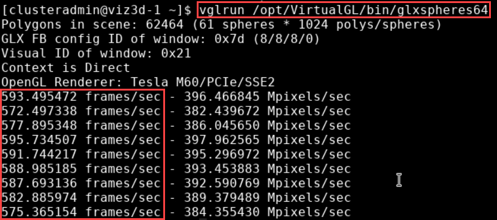

22. Performances should be increased to about **400 frames/sec** depending on your screen size, quality and compression options.

      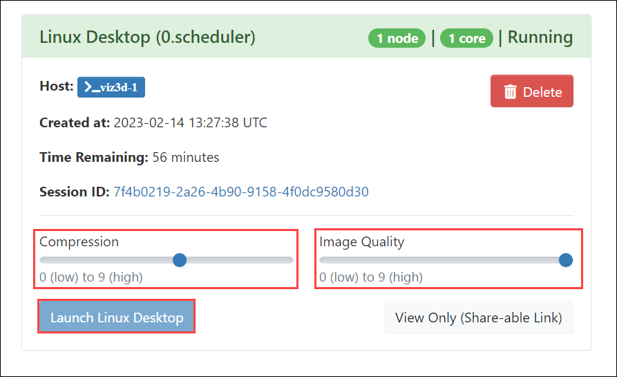

23. Start a new terminal and launch `nvidia-smi` to check the GPU usage which should be about **35%**.

      > **Note**: The `vglrun` command can be called for all applications which use Opengl to offload calls to the GPU.

24. Switch back to the **My Interactive Sessions** launching page and use the **Delete** button to delete the **Linux Desktop** jobs by selecting **Confirm** when prompted.

25. Delete any remaining sessions.

26. Click the **Next** button located in the bottom right corner of this lab guide to continue with the next exercise.