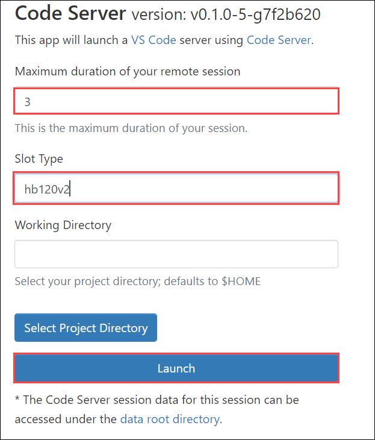
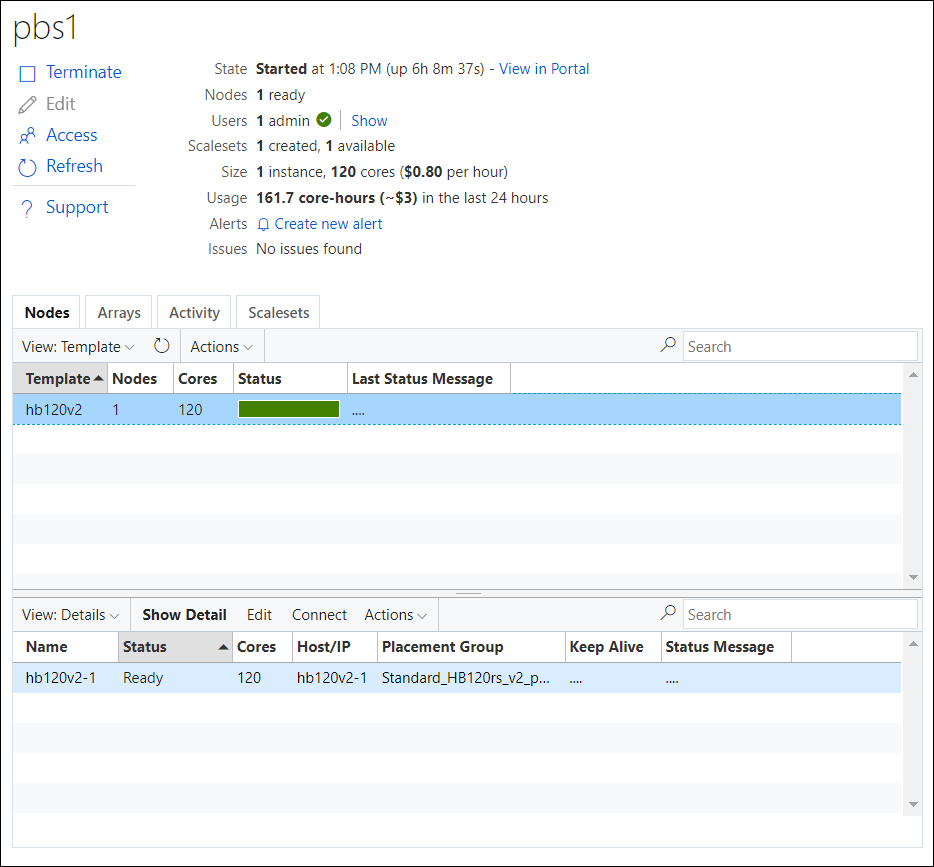
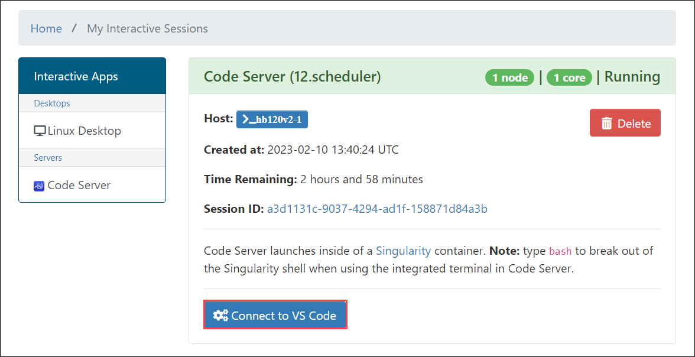
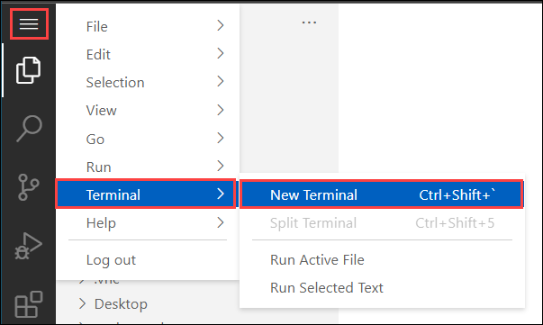
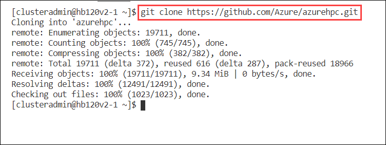

## Exercise 3: Set up Spack

Duration: 30 minutes

In this exercise, you will install and configure Spack from Code Server, as documented in [https://azure.github.io/az-hop/tutorials/spack.html](https://azure.github.io/az-hop/tutorials/spack.html).

### Task 1: Create a Code Server session

1. On the lab computer, in the browser window, switch to the tab displaying the **Azure HPC On-Demand Platform** portal.

2. Select the **Interactive Apps** menu, and from the drop-down menu, select **Code Server**.

   

   > **Note**: This will open another browser tab displaying the **Code Server** launching page.

3. On the **Code Server** launching page, in the **Maximum duration of your remote session** field, enter **3**. In the **Slot Type** text box, enter **hb120v2**, and then select **Launch**.

   

   > **Note**: This will initiate the provisioning of a compute node of the type you specified. Note that this creates a new job and the **Queued** status for this job is displayed on the same page.

4. Switch to the **Azure CycleCloud for Azure HPC On-Demand Platform** portal and monitor the progress of the **hb120v2** node provisioning.

   

   > **Note**: Wait until the node status changes to **Ready**. This should take about 5 minutes.

5. Switch back to the **Code Server** launching page, verify that the corresponding job's status has changed to **Running**, and then select **Connect to VS Code**.

   > **Note**: This will open another browser tab displaying the Code Server interface.

   

6. Review the interface, and then close the **Welcome** tab.

7. Select the **Application** menu, from the drop-down menu select **Terminal**, and then from the sub-menu that opens, select **New Terminal**.

   

8. In the **Terminal** pane, at the **[clusteradmin@hb120v2-1 ~]$** prompt, run the following command to clone the azurehpc repo and use the azhop/spack branch:

   ```bash
   cd
   git clone https://github.com/Azure/azurehpc.git
   ```

   

### Task 2: Install Spack

1. In the **Terminal** pane, review and then run the following scripts to install and configure `Spack`:

   ```bash
   ~/azurehpc/experimental/azhop/spack/install.sh
   ~/azurehpc/experimental/azhop/spack/configure.sh
   ```

   > **Note**: The output should resemble the following listing:

   ```bash
   [clusteradmin@hb120v2-1 ~]$ ~/azurehpc/experimental/azhop/spack/install.sh
   Cloning into '/anfhome/clusteradmin/spack'...
   remote: Enumerating objects: 402411, done.
   remote: Counting objects: 100% (163/163), done.
   remote: Compressing objects: 100% (122/122), done.
   remote: Total 402411 (delta 70), reused 83 (delta 19), pack-reused 402248
   Receiving objects: 100% (402411/402411), 200.65 MiB | 45.82 MiB/s, done.
   Resolving deltas: 100% (161555/161555), done.
   Note: checking out '13e6f87ef6527954b152eaea303841978e83b992'.

   You are in 'detached HEAD' state. You can look around, make experimental
   changes and commit them, and you can discard any commits you make in this
   state without impacting any branches by performing another checkout.

   If you want to create a new branch to retain commits you create, you may
   do so (now or later) by using -b with the checkout command again. Example:

   git checkout -b new_branch_name

   Checking out files: 100% (9474/9474), done.

   [clusteradmin@hb120v2-1 ~]$ ~/azurehpc/experimental/azhop/spack/configure.sh
   Configuring for OpenMPI Version 4.1.1
   Configuring for HPCX Version 2.9.0
   Configuring for GCC version 9.2.0
   Add GCC compiler
   ==> Added 1 new compiler to /anfhome/clusteradmin/.spack/linux/compilers.yaml
      gcc@9.2.0
   ==> Compilers are defined in the following files:
      /anfhome/clusteradmin/.spack/linux/compilers.yaml
   Configure external MPI packages
   Configure local settings
   ```

2. Run the following commands to confirm the list of defined compilers:

   ```bash
   . ~/spack/share/spack/setup-env.sh
   spack compilers
   ```

   > **Note**: The output should resemble the following listing:

   ```bash
   ==> Available compilers
   -- gcc centos7-x86_64 -------------------------------------------
   gcc@9.2.0
   ```

   > **Note**: Verify that gcc 9.2 is referenced in the output.

3. Click the **Next** button located in the bottom right corner of this lab guide to continue with the next exercise.
