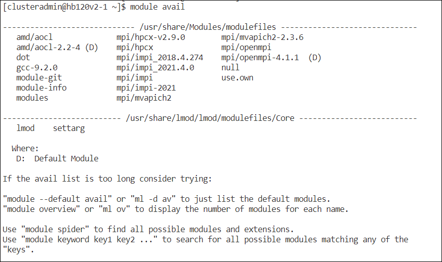
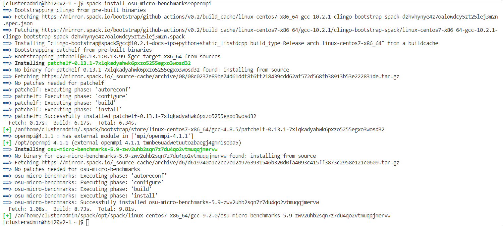
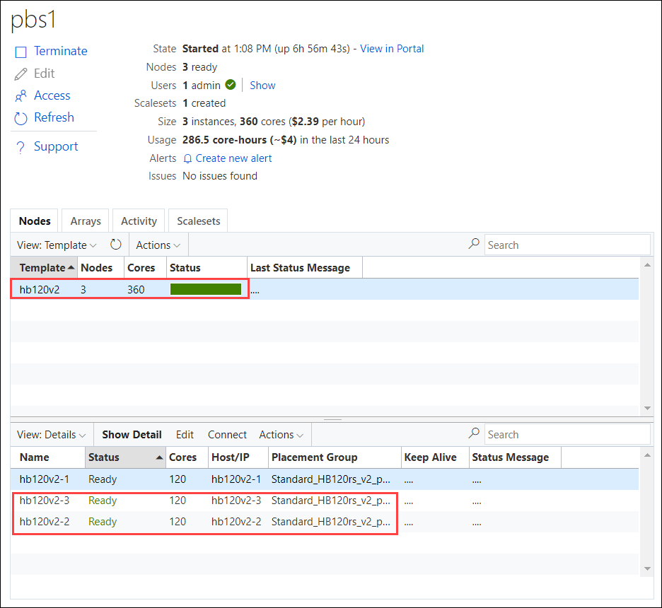
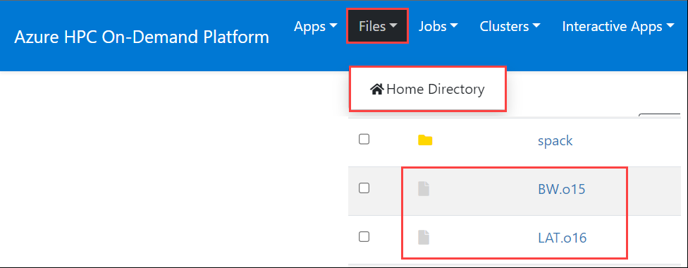

## Exercise 4: Build and run OSU Benchmarks
In this exercise, you will build and run some of the OSU Benchmarks used to measure latency and bandwidth using OpenMPI.

Duration: 30 minutes
### Task 1: Build OSU Benchmarks with OpenMPI

1. On the lab computer, in the browser window displaying the Code Server, in the **Terminal** pane, at the **[clusteradmin@hb120v2-1 ~]$**  prompt, run the following command to load Spack modules:

   ```bash
   . ~/spack/share/spack/setup-env.sh
   module use /usr/share/Modules/modulefiles
   ```
2. List modules available. These contains the all the modules provided in the Azure HPC marketplace image, like Intel MPI, OpenMPI, HPCX and MVAPICH2.

   ```bash
   module avail
   ```

   

    > **Note**: The output should resemble the following listing:
    
3. Install OSU benchmarks with Spack and OpenMPI

   ```bash
   spack install osu-micro-benchmarks^openmpi
   ```

   

This will download the source packages and build them in your environment.

### Task 2: Create the run script

1. At the root of the home directory, create a file named **osu_benchmarks.sh** with this content

    ```bash
    sudo su -
    vi osu_benchmarks.sh
    ```

2. Paste the below script.

    ```bash
    #!/bin/bash
    BENCH=${1:-osu_latency}
    . ~/spack/share/spack/setup-env.sh
    source /etc/profile.d/modules.sh
    module use /usr/share/Modules/modulefiles
    spack load osu-micro-benchmarks^openmpi
    mpirun -x PATH --hostfile $PBS_NODEFILE --map-by ppr:1:node --bind-to core --report-bindings $BENCH
    ```
    
3. Then press **_ESC_**, write **_:wq_** to save your changes and close the file.
    
    >**Note**: If **_ESC_** doesn't work press `ctrl+[` and then write **_:wq_** to save your changes and close the file.

4. Enable execution for this script

    ```bash
    chmod +x ~/osu_benchmarks.sh
    exit
    ```

### Task 3: Submit OSU jobs

1. Submit a first job for running the bandwidth benchmarks. Note the **slot_type** used in the select statement to specify on which CycleCloud node array to submit to.

    ```bash
    qsub -N BW -joe -koe -l select=2:slot_type=hb120v2 -- osu_benchmarks.sh osu_bw
    ```

2. And a second one for the latency test

    ```bash
    qsub -N LAT -joe -koe -l select=2:slot_type=hb120v2 -- osu_benchmarks.sh osu_latency
    ```

3. Check the jobs statuses within the terminal or thru the web UI as well as the node provisioning state in the CycleCloud portal.

    

4. Review the results of the jobs in files names **LAT.o??** and **BW.o??** at the root of the home directory

    

 5. Click the **Next** button located in the bottom right corner of this lab guide to continue with the next exercise.   