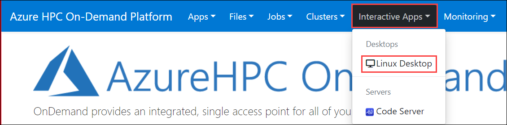
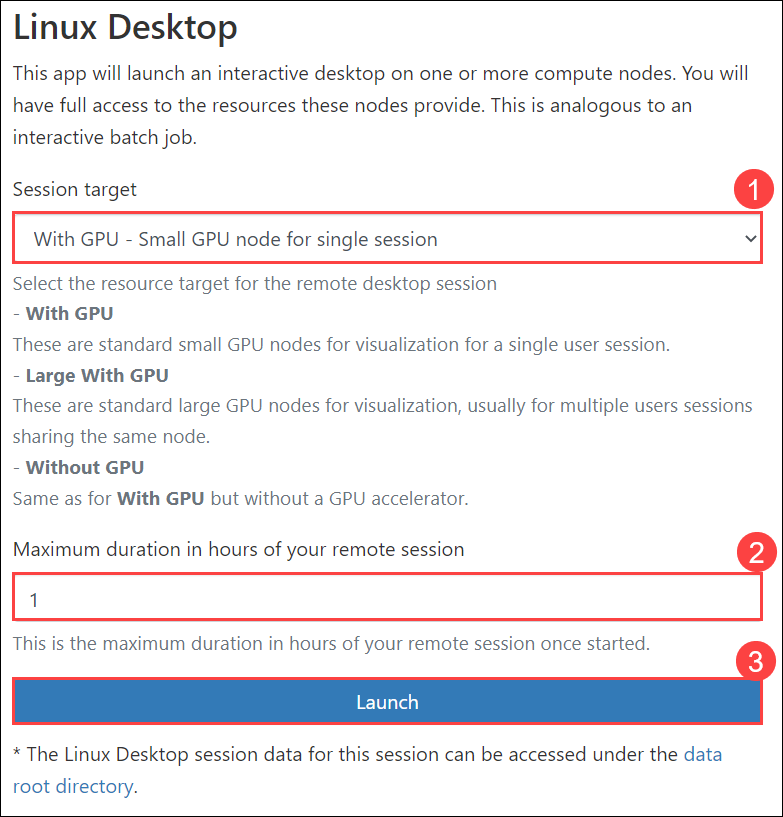
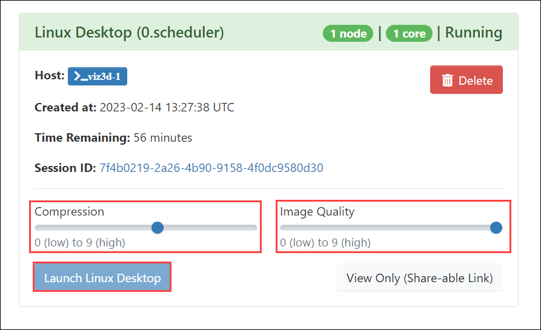
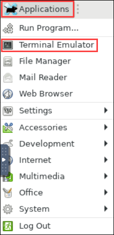
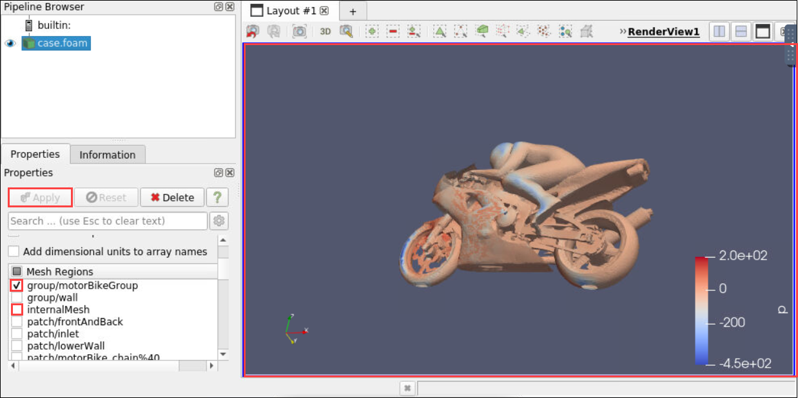
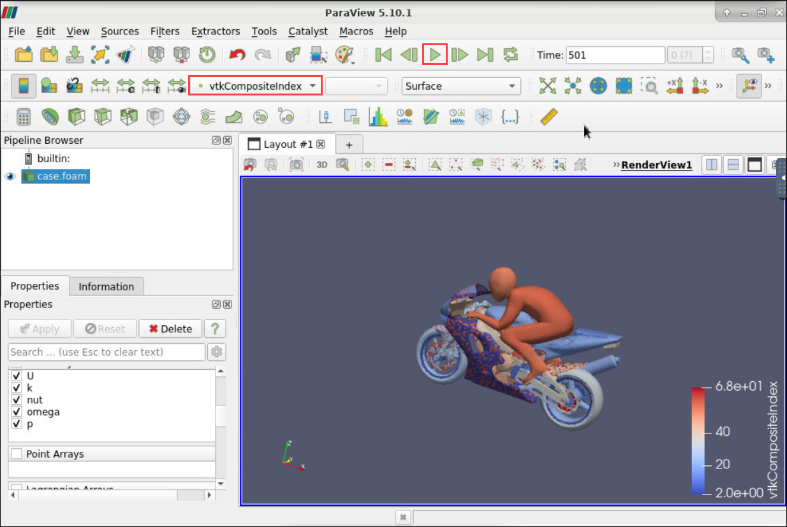

## Exercise 5: Build, run, and analyze OpenFOAM

In this exercise, you will build, run, and analyze CFD simulation using OpenFOAM.

Duration: 60 minutes

### Task 1: Build OpenFOAM

1. On the lab computer, in the browser window displaying the Code Server, in the **Terminal** pane, at the **[clusteradmin@hb120v2-1 ~]$**  prompt, run the following command to build OpenFOAM 8:

   ```bash
   . ~/spack/share/spack/setup-env.sh
   module use /usr/share/Modules/modulefiles
   spack install openfoam-org@8
   ```
   > Note: Wait for the build to complete. This might take about 50 minutes.

### Task 2: Running the motorbike tutorial on a single node

1. On the lab computer, in the browser window displaying the Code Server, in the **Terminal** pane, at the **[clusteradmin@hb120v2-1 ~]$**  prompt, run the following command to load OpenFOAM modules:
   
   ```bash
   spack load openfoam-org@8
   ```

1. Copy the motorbike tutorial into your home directory

   ```bash
   cd /anfhome/clusteradmin
   cp -r $WM_PROJECT_DIR/tutorials/incompressible/simpleFoam/motorBike .
   ```

1. Run the case
   ```bash
   cd motorBike
   ./Allrun
   ```
   > **Note** : This is taking few minutes.

4. Review all log files `log.*` for any errors

### Task 3: Running the motorbike tutorial on multiple nodes

The following updates are needed:

- Add FOAM_MPIRUN_FLAGS to the mpirun command when using runParallel (needed for all version of OpenFOAM)
- Reconstruct the single partition after the solve

1. On the lab computer, in the browser window displaying the Code Server, in the **Terminal** pane, at the **[clusteradmin@hb120v2-1 clusteradmin]$**  prompt, run the following commands:

   ```bash
   cd motorBike
   sed -i '/RunFunctions/a source <(declare -f runParallel | sed "s/mpirun/mpirun \\\$FOAM_MPIRUN_FLAGS/g")' Allrun
   sed -i 's#/bin/sh#/bin/bash#g' Allrun
   sed -i 's/# runApplication reconstructPar/runApplication reconstructPar/g' Allrun
   ```

2. Now, create a PBS submit script, **submit.sh** with the following content.

- When running on multiple nodes it is necessary to export all the OpenFOAM environment variables (unless you add loading the modules in `.bashrc`). This is done with the `FOAM_MPIRUN_FLAGS` that are added to the `runParallel` in the last step. The script will run for the number of cores specified to PBS (`select` x `mpiprocs`)

   ```bash
   #!/bin/bash
   . ~/spack/share/spack/setup-env.sh
   module use /usr/share/Modules/modulefiles
   spack load openfoam-org@8
   ranks_per_numa=4
   export FOAM_MPIRUN_FLAGS="-hostfile $PBS_NODEFILE $(env |grep 'WM_\|FOAM' | cut -d'=' -f1 | sed 's/^/-x /g' | tr '\n' ' ') -x MPI_BUFFER_SIZE --report-bindings --map-by ppr:${ranks_per_numa}:numa"
   $PBS_O_WORKDIR/Allrun -cores $(wc -l <$PBS_NODEFILE)
   ```

3. Then press **_ESC_**, write **_:wq_** to save your changes and close the file.
    
    >**Note**: If **_ESC_** doesn't work press `ctrl+[` and then write **_:wq_** to save your changes and close the file.

4. Save that file under `motorBike/submit.sh`

5. Run the OpenFOAM job
Here we ask for 2 node from the node array **hb120v2** using 120 cores on each, and asking to be exclusive on these 2 nodes.

   ```bash
   cd motorBike
   rm log.*
   qsub -l select=2:slot_type=hb120v2:ncpus=120:mpiprocs=120,place=scatter:excl submit.sh
   ```

6. Monitor the job and wait for the job to be finished

### Task 4: Visualize the motorbike tutorial result

1. On the lab computer, in the browser window, switch back to the **Azure HPC On-Demand Platform** portal, and then in the **Interactive Apps** section, select **Linux Desktop**.

   

2. On the **Linux Desktop** launching page, from the **Session target** drop-down list, ensure that **With GPU - Small GPU node for single session** entry is selected. In the **Maximum duration of your remote session** field, enter **1**,  and then select **Launch**.

   

      > Note: This will begin compute node provisioning of the type you specified. This also creates a new job with its **Queued** status displaying on the same page.

3. Switch back to the **Linux Desktop** launching page, and then verify that the corresponding job's status has changed to **Running**.

4. Adjust **Compression** and **Image quality** according to your preferences, and then select **Launch Linux Desktop**.

   
   
   > Note: This will open another browser tab displaying the Linux Desktop session.

5. Within the Linux Desktop session, Click on **Applications** and open a **Terminal Emulator**.

      

6. Install the **ParaView** viewer:

   ```bash
   cd /anfhome/clusteradmin
   wget "https://www.paraview.org/paraview-downloads/download.php?submit=Download&version=v5.10&type=binary&os=Linux&downloadFile=ParaView-5.10.1-MPI-Linux-Python3.9-x86_64.tar.gz" -O ParaView-5.10.1-MPI-Linux-Python3.9-x86_64.tar.gz
   tar xvf ParaView-5.10.1-MPI-Linux-Python3.9-x86_64.tar.gz
   ```

7. Create a case file and launch ParaView

   ```bash
   touch motorBike/case.foam
   vglrun ./ParaView-5.10.1-MPI-Linux-Python3.9-x86_64/bin/paraview
   ```

8. Open the model, Within **ParaView** open the case `motorBike/case.foam`

9. When the model is loaded, you can view the geometry like this:
   - In the bottom left pane, in the "Mesh Regions" list, unselect "internalMesh" and select "group/motorBikeGroup".
   - Click "Apply" above the list.
   - You should now see the model geometry, and you can move/rotate/zoom using the mouse.

      


10. Next, you can visualize the simulation results.

      - Click the "Play" button on the toolbar at the top of the window to advance to the end of the simulation.
      - On the Active Variables Control toolbar you will find a drop down box where you can select variables. For example, select "p" for pressure.

        

11. Click the **Next** button located in the bottom right corner of this lab guide to continue with the next exercise.   